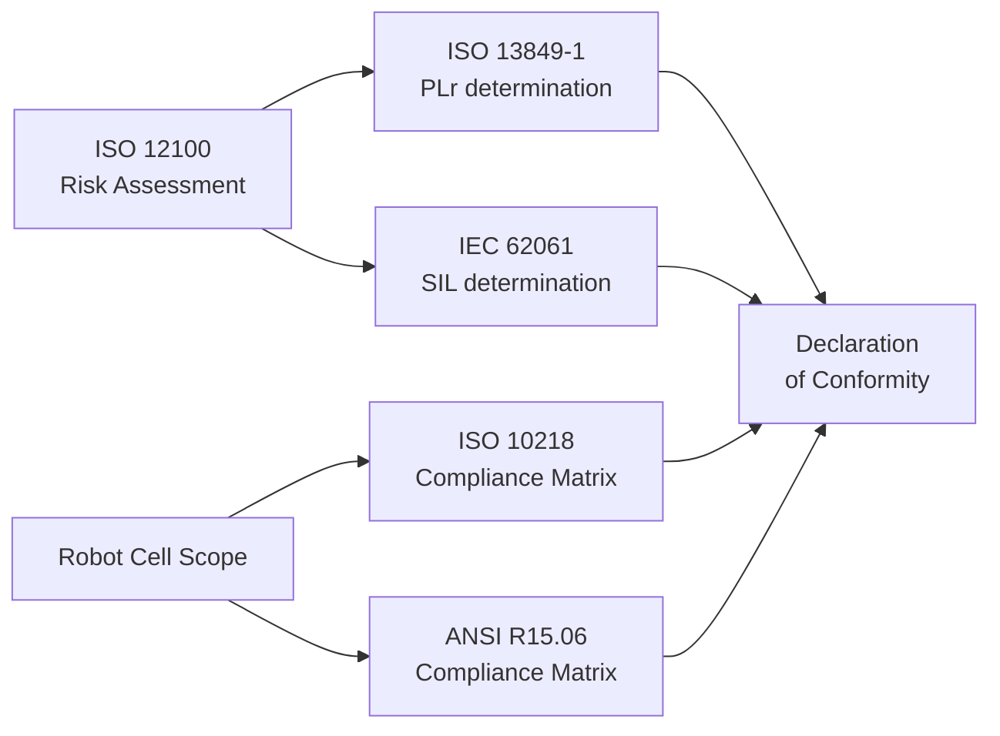

The compliance and integrity cluster translates the quantitative risk estimates produced by the foundation cluster into formal safety integrity determinations and regulatory compliance evidence. Five builder skills operate in sequence: PLr and SIL skills consume the safety function register from the ISO 12100 risk assessment workbook and calculate the required performance level and safety integrity level for each function; the ISO 10218 and ANSI R15.06 compliance matrix skills check every applicable clause of those standards against the cell design; and the Declaration of Conformity builder assembles the CE marking package required under EU Machinery Regulation 2023/1230. Together these five pairs provide the complete compliance evidence file for a robot cell delivery.

## How this cluster fits the chain

The compliance and integrity cluster sits immediately downstream of the foundation cluster and feeds directly into cell commissioning and delivery:



<Note>
  The PLr and SIL builder skills read the **Safety Function Register** tab from `iso12100-risk-assessment.xlsx` directly. Severity (S), probability (P), frequency (F), and avoidability (A) values flow into the calculation sheets without manual re-entry.
</Note>

## Skill pairs

<CardGroup cols={2}>
  <Card title="ISO 13849-1 PLr determination" icon="calculator" href="/skills/iso13849-plr">
    **Standard:** ISO 13849-1:2023

    Builder calculates required Performance Level (PLr) for each safety function using the risk parameters from upstream. Determines category (B, 1, 2, 3, 4), MTTFd per channel, diagnostic coverage (DC), and common cause failure (CCF) score. Reviewer validates calculations against ISO 13849-1 Annex K and generates KPI dashboard.
  </Card>
  <Card title="IEC 62061 SIL determination" icon="calculator" href="/skills/iec62061-sil">
    **Standard:** IEC 62061:2021

    Builder calculates required Safety Integrity Level (SIL) using risk graph parameters. Computes PFHD (probability of dangerous failure per hour), beta factors for common cause failure, and subsystem SIL capability. Reviewer validates against IEC 62061 Annex F and IEC 61508 SIL assignment tables.
  </Card>
  <Card title="ISO 10218 compliance matrix" icon="table" href="/skills/iso10218-compliance-matrix">
    **Standard:** ISO 10218-1/-2:2025

    Builder produces a clause-by-clause compliance matrix for both ISO 10218-1 (robot manufacturer requirements) and ISO 10218-2 (integration requirements). Each clause is rated Compliant / Partial / Not Applicable / Non-Compliant with evidence references. Reviewer generates a stacked compliance bar and findings table.
  </Card>
  <Card title="ANSI R15.06 compliance matrix" icon="table" href="/skills/ansi-r1506-compliance-matrix">
    **Standard:** ANSI/RIA R15.06-2012 R2017

    Builder produces the North American equivalent compliance matrix covering all ANSI R15.06 clauses. Required for US and Canadian market deliveries alongside or instead of ISO 10218. Reviewer confirms coverage against R15.06-2012 R2017 and flags clauses requiring additional evidence.
  </Card>
  <Card title="Declaration of Conformity" icon="file-certificate" href="/skills/declaration-of-conformity">
    **Standard:** EU Machinery Regulation 2023/1230

    Builder assembles the CE marking Declaration of Conformity with the complete list of applied harmonized standards, notified body references (where applicable), authorized signatory, and issue date. Reviewer validates DoC structure against Annex V of Regulation 2023/1230 and checks harmonized standards list completeness.
  </Card>
  <Card title="Next: cell design cluster" icon="arrow-right" href="/clusters/cell-design">
    Once PLr/SIL determinations are confirmed, move to the cell design cluster to produce the safety I/O matrix and interlock architecture that implements those requirements in hardware.
  </Card>
</CardGroup>

## PLr determination: key parameters

The `iso13849-plr-builder` skill calculates PLr for each safety function across four parameters derived from the upstream risk assessment:

<AccordionGroup>
  <Accordion title="Category (B, 1, 2, 3, 4)" icon="list-ol">
    Category is the structural requirement for the safety-related part of the control system (SRP/CS). It defines how a system behaves on detection of a fault:

    | Category | Fault-tolerant behaviour |
    |---|---|
    | B | Basic — no fault tolerance required |
    | 1 | Well-tried components and principles |
    | 2 | Fault detected by periodic test |
    | 3 | Single fault does not cause loss of safety function |
    | 4 | Single fault detected immediately; accumulation tolerated |

    The builder maps each safety function's PLr to the minimum category required and flags category shortfalls against the as-designed architecture.
  </Accordion>
  <Accordion title="MTTFd — mean time to dangerous failure" icon="clock">
    MTTFd is calculated per channel (redundant or single, depending on category) from component B10d values and annual operating hours:

    ```text
    MTTFd = B10d / (0.1 × nop)
    nop   = operating cycles per year
    ```

    The builder prompts for B10d data from component datasheets and computes channel MTTFd and system MTTFd according to ISO 13849-1 Annex C and Annex D tables.
  </Accordion>
  <Accordion title="DC — diagnostic coverage" icon="stethoscope">
    Diagnostic coverage is the fraction of dangerous failures detected by automatic diagnostics. The builder applies the DC estimation method from ISO 13849-1 Annex E, mapping test intervals and test coverage to Low / Medium / High / Very High DC bands.
  </Accordion>
  <Accordion title="CCF — common cause failure" icon="link-slash">
    Common cause failure score is computed using the checklist in ISO 13849-1 Annex F. A score of 65 points or above is required for categories 2, 3, and 4. The builder scores each CCF measure (separation, diversity, protection against overvoltage, training) and flags shortfalls.
  </Accordion>
</AccordionGroup>

## SIL determination: key parameters

The `iec62061-sil-builder` skill computes SIL using IEC 62061 risk graph parameters:

<AccordionGroup>
  <Accordion title="PFHD — probability of dangerous failure per hour" icon="chart-line">
    PFHD is the primary SIL metric. Each subsystem (initiating, logic, final) contributes a PFHD value; the subsystem PFHDs are summed to give the system PFHD. The builder applies IEC 62061 clause 6.7 to convert component failure rate data to PFHD and checks the result against SIL 1/2/3 PFHD ranges.

    | SIL | PFHD range |
    |---|---|
    | SIL 1 | ≥ 10⁻⁶ to < 10⁻⁵ |
    | SIL 2 | ≥ 10⁻⁷ to < 10⁻⁶ |
    | SIL 3 | ≥ 10⁻⁸ to < 10⁻⁷ |
  </Accordion>
  <Accordion title="Beta factors for common cause failure" icon="link-slash">
    Beta factors reduce the effective PFHD for redundant subsystems by accounting for the proportion of failures that affect both channels simultaneously. The builder applies the beta factor estimation table from IEC 62061 Annex D, with separate beta values for hardware (β) and diagnostic (βD) contributions.
  </Accordion>
</AccordionGroup>

## Standards targeted

| Standard | Scope |
|---|---|
| ISO 13849-1:2023 | PLr determination — category, MTTFd, DC, CCF |
| IEC 62061:2021 | SIL determination — PFHD, beta factors, subsystem architecture |
| ISO 10218-1/-2:2025 | Clause-by-clause compliance for robot and integration |
| ANSI/RIA R15.06-2012 R2017 | North American compliance matrix |
| EU Machinery Regulation 2023/1230 | CE marking — Declaration of Conformity, Annex V |
| IEC 61508 | Underlying SIL assignment and functional safety framework |

<Warning>
  ISO 10218-1/-2 was substantially revised in 2025. If you are working against an existing project that used the 2011 edition, run the compliance matrix builder against the 2025 edition to identify clauses that require re-evaluation before delivery.
</Warning>

<Tip>
  For cells that ship to both EU and US/Canadian markets, run both the ISO 10218 and ANSI R15.06 compliance matrix builders. The Declaration of Conformity builder can reference both matrices in the harmonized standards list.
</Tip>
